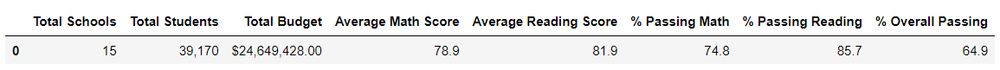
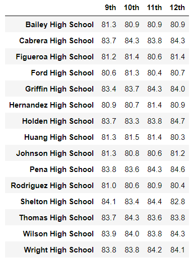

# School-District-Analysis

## Overview
Evidence of academic dishonesty in standardized testing scores of ninth grade students in Thomas High School has prompted a reassessment of the school district's performance as a whole. In order to determine the extent of academic dishonesty, the analysis of the school district's performance was repeated after the math and reading scores of ninth grade Thomas High school students were removed from analysis. 

## Resources
Data sources: 
* [clean_students_complete.csv](Resources/clean_students_complete.csv)
* [students_complete.csv](Resources/students_complete.csv)
* [school_complete.csv](Resources/school_complete.csv) <!--link the CSVs after uploading-->

Software:
* Python 3.7.10
* Jupyter Notebook
* Anaconda
* Visual Studio Code 1.62.3

# Results
Seven school district metrics were produced initially, and have been reproduced to compare how performances were affected by the ninth grade Thomas High School scores below.

### 1. How is the district summary affected?
Changes to the district summary metric were contained to Thomas High School only. The district summary was largely unchanged after reanalysis when considering performance to the nearest percent.  
    

    
District Summary comparison

    Reanalyzed
     
    Original
     
    

### 2. How is the school summary affected? 
Per conditions of reanalysis, math and reading scores were removed for 9th grade students from Thomas High School and replaced with "NaN". After reanalysis, Thomas High School saw decrease in all areas of performance: average math and reading scores, percentage of students passing math and reading as well as percentage of students passing both math and reading. However, the magnitude of the difference between the original and reanalyzed figures is very minimal (at most 0.31% as seen in % overall passing numbers), indicating that the ninth grade scores of Thomas High School were close enough to the school's average that removing them did not affect the overall school's performance numbers in a significant way.
    

    
Comparison of Thomas High School Summaries

      Reanalyzed
     
      Original
     
    

### 3. How did replacing ninth grade Thomas High School scores affect the school's performance compared to other schools in the district?
Replacing Thomas High School ninth grade scores did not affect the school's performance relative to the other schools in the district.
Thomas High School remained the second best performing school in the district even after the slight decrease in overall performance.
    

    
Top 5 Performing Schools Ranked by Percent Overall Passing

      Reanalyzed
     
      Original
     
    

### 4. How does replacing the ninth-grade scores affect scores by:

Grade Level? Both math and reading scores now read "NaN".

  Reanalyzed Math by Grade
    
    
  Original Math by Grade
     
    
  Reanalyzed Reading by Grade 
     
    
  Original Reading by Grade
     
    

School Size? Unchanged after analysis.

  Reanalyzed
    
  Original
 

Spending? Unchanged after analysis.

  Reanalyzed
 

School Type? Unchanged after analysis.

  Reanalyzed

    
  Original
 

# Summary
In summary, removing scores from ninth grade students of Thomas High School only slightly lowered school district performance, and had similarly minimal effect on performance within Thomas High School. The reanalysis showed that the major changes include:
* Average math score decreased from 79.0% to 78.9%
* Passing math percentage decreased from 75% to 74.8%
* Passing reading percentage decreased to 86% to 85.7%
* Overall passing percentage decreased 65% to 64.9%
