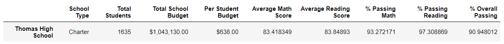

# School-District-Analysis

## Overview
Evidence of academic dishonesty in standardized testing scores of ninth grade students in Thomas High School has prompted a reassessment of the school district's performance as a whole. In order to determine the extent of academic dishonesty, the analysis of the school district's performance was repeated after the math and reading scores of ninth grade Thomas High school students were removed from analysis. 

### Resources
Data sources: 
* [clean_students_complete.csv](Resources/clean_students_complete.csv)
* [students_complete.csv](Resources/students_complete.csv)
* [school_complete.csv](Resources/school_complete.csv) <!--link the CSVs after uploading-->

Software:
* Python 3.7.10
* Jupyter Notebook
* Anaconda
* Visual Studio Code 1.62.3

## Results
Seven school district metrics were produced initially, and have been reproduced to compare how performances were affected by the ninth grade Thomas High School scores below.

### 1. Changes to the district summary metric were contained to Thomas High School
After reanalysis, Thomas High School saw decrease in all areas of performance: average math and reading scores, percentage of students passing math and reading as well as percentage of students passing both math and reading. However, the magnitude of the difference between the original and reanalyzed figures is very minimal (at most 0.31% as seen in % overall passing numbers), indicating that the ninth grade scores of Thomas High School were close enough to the school's average that removing them did not affect the overall school's performance numbers in a significant way.

District Summary Comparison

  Reanalyzed
 
  Original
 

### 2. School summary 
Per conditions of reanalysis, math and reading scores were removed for 9th grade students from Thomas High School and replaced with "NaN".
  

  
School Summary Comparison for Thomas High School

    Reanalyzed
   
    Original
   
  

### 3. Replacing Thomas High School ninth grade scores did not affect the school's performance relative to the other schools in the district.
  

  
District Summary Comparison

    Reanalyzed
   
    Original
   
  

4. Average Math and Reading Scores by grade level
  

  
District Summary Comparison

    Reanalyzed
   
    Original
   
  

5. Average Math and Reading Scores by school size
  

  
District Summary Comparison

    Reanalyzed
   
    Original
   
  

6. Average Math and Reading Scores by spending
  

  
District Summary Comparison

    Reanalyzed
   
    Original
   
  

7. Average Math and Reading Scores by school type
  

  
District Summary Comparison

    Reanalyzed
   
    Original
   
  

## Summary
